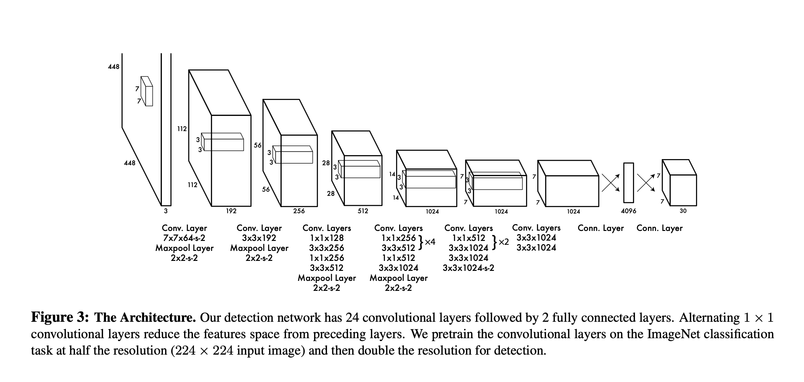

# You Only Look Once: Unified, Real-Time Object Detection

[paper](./assets/yolov1.pdf)

## 1. Introduction

- Traditional detection systems:
  - Deformable Parts Model (DPM): Uses sliding window and runs classifier over each window.
  - R-CNN: Generate bounding boxes and run classifier on proposed boxes.
- YOLOv1: Use single neural network going from images straight to CNN (regression problem).

  1. Resize 448x448
  2. CNN
  3. Confidence score

  

## 2. Unified Detection

- Confidence = $Pr(Object)*IOU^{truth}_{pred}$
- IOU: Intersection over union
  - Overlap between predicted bounding box with ground-truth bounding box.
- Bounding box is function of 5 variables:

  - x: x-coordinate of center
  - y: y-coordinate of center
  - w: width of box
  - h: height of box
  - confidence: confidence of box

- $Pr(Class_i|Object)*Pr(Object)*IOU^{truth}_{pred} = Pr(Class_i)*IOU^{truth}_{pred}$

  - Multiply conditional class probability with individual box confidence for class specific score for each box.
    > For evaluating YOLO on PASCAL VOC, we use S = 7, B = 2. PASCAL VOC has 20 labelled classes so C = 20. Our final prediction is a 7 × 7 × 30 tensor.

  

## 2.1 Network Design

- Evaluated on Pascal VOC detection dataset.

## 2.2 Training

- Pretrained first 20 convolutional layers on ImageNet 1000-class competition dataset.
- Added 4 convolutional layers and 2 fully connected layers.
  - Adding to pretrained models has been shown to improve performance.
- Normalize width and height by image width and height (value between 0 and 1).
- Parametrize x and y to be offsets of a grid location (value between 0 and 1).
- Linear activation function for final layer.
- Leaky rectifier linear activation function for other layers.
  - $\phi(x)=\begin{cases} x &\text{if } x>0 \\ 0.1x \ x &\text{otherwise}\end{cases}$
- Loss function: sum-squared error.
  - Easy to optimize.
  - May not be optimized for precision.
    > It weights localization er- ror equally with classification error which may not be ideal. Also, in every image many grid cells do not contain any object. This pushes the “confidence” scores of those cells towards zero, often overpowering the gradient from cells that do contain objects. This can lead to model instability, causing training to diverge early on.
  - To mitigate, increase loss for box coordinate prediction and decrease loss for confidence prediction for box with no object.
    > We use two parameters, λcoord and λnoobj to accomplish this. We set λcoord = 5 and λnoobj = .5.
  - Equally weights errors for big and small boxes. Small differences for large boxes matters less. To mitigate, predict square root of width and height.
- Hyperparameters:
  - Dataset: Pascal VOC 2007/2012
    > For data augmentation we introduce random scaling and translations of up to 20% of the original image size. We also randomly adjust the exposure and saturation of the im- age by up to a factor of 1.5 in the HSV color space.
  - Epochs: 135
  - Batch size: 64
  - Momentum: 0.9
  - Decay: 0.0005
  - Learning rate: slowly raise from $10^{-3}$ to $10^{-2}$, then $10^{-2}$ for 75 epochs, then $10^{-3}$ for 30 epochs, then $10^{-4}$ for 30 epochs.
  - Dropout layer rate: 0.5 after first connected layer.

## 2.3 Inference

- Fast since only 1 neural network compared to traditional methods.

## 2.4 Limitations of YOLO

- Struggles with small object in groups since 2 boxes and 1 class per grid.
- Struggles to generalize object of different aspect ratio and configuration.
- Unproportional detection error for big and small boxes.

## 4.1 Comparison to Other Real-Time Systems

## 4.2 VOC 2007 Error Analysis

## 4.3 Combining Fast R-CNN and YOLO

# YOLO
